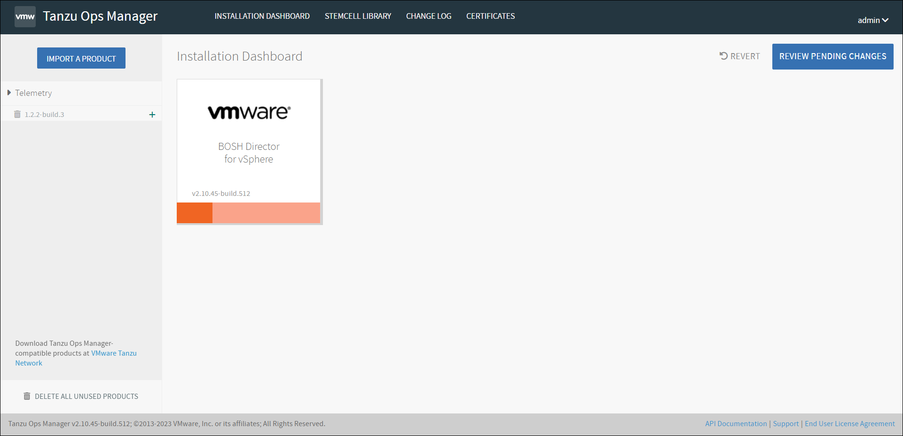
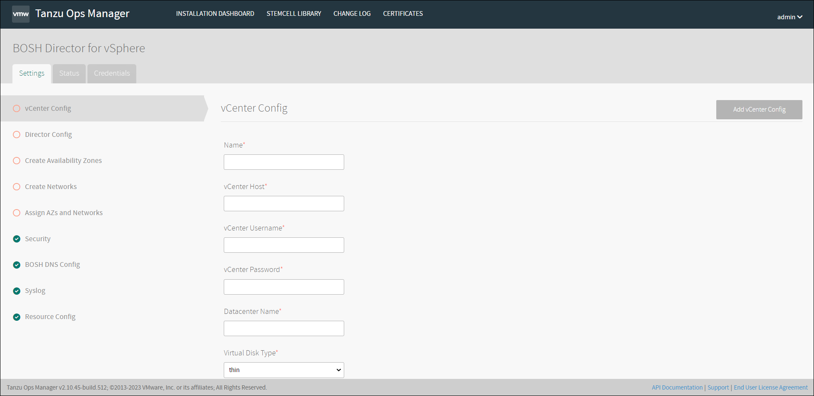
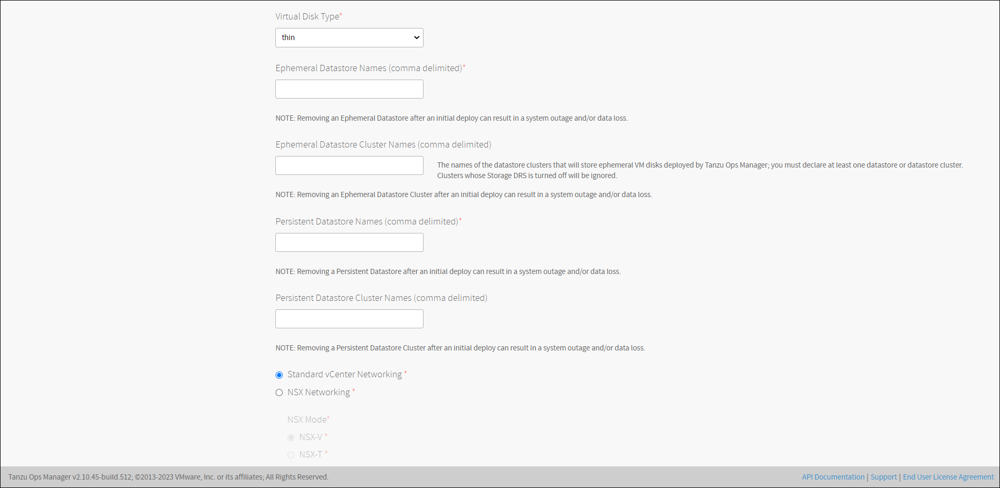
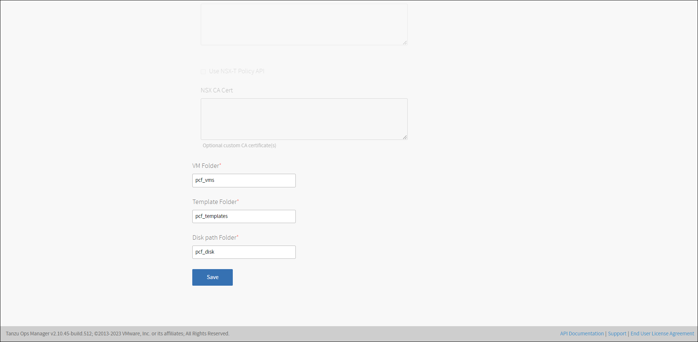

# 설치 방법

## BOSH Director 설치

#### BOSH Director for vSphere

- **vCenter Config**

1. **Name :** 운영자가 구분할 수 있는 이름을 작성합니다. 여러 데이터 센터를 구성하는 경우 Ops Manager에서 데이터 센터 구성을 식별하는 데 사용됩니다.

2. **vCenter Host :** ESXi/vSphere를 관리하는 vCenter의 호스트 이름입니다.

3. **vCenter Username :** 가상 머신(VM) 및 폴더에 대한 생성 및 삭제 권한이 있는 vCenter 사용자 이름입니다.

4. **vCenter Password :** 위에서 지정한 vCenter 사용자의 비밀번호입니다.

5. **Datacenter Name :** vCenter에 표시되는 데이터 센터의 이름입니다.

6. **Virtual Disk Type :** 모든 VM에 대해 프로비저닝할 가상 디스크 유형입니다. 가상 디스크 유형 선택에 대한 지침은 [vSphere 가상 디스크 유형을](https://docs.pivotal.io/application-service/operating/disk-format.html) 참조하십시오 .
   
   ※ *Note:  데이터 저장소는 이름에 공백 문자를 지원하지 않습니다. 데이터 저장소 이름에 공백 문자를 포함하면 오류가 발생합니다.*

7. **Ephemeral Datastore Names (comma delimited) :** Ops Manager에서 배포한 임시 VM 디스크를 저장하는 데이터 저장소의 이름입니다.

8. **Ephemeral Datastore Cluster Names (comma delimited) :** Ops Manager에서 배포한 임시 VM 디스크를 저장하는 데이터 저장소 클러스터의 이름입니다. 데이터 저장소 이름과 데이터 저장소 클러스터가 지정된 경우 둘 다 디스크 배치에 대해 고려됩니다. 데이터스토어 클러스터에 대해 Storage DRS를 비활성화하면 BOSH CPI가 클러스터를 무시합니다. 자세한 내용은 [Storage DRS 활성화 및 비활성화를](https://docs.vmware.com/en/VMware-vSphere/7.0/com.vmware.vsphere.resmgmt.doc/GUID-827DBD6D-08B7-4411-9214-9E126671457F.html) 참조하십시오 .

9. **Persistent Datastore Names (comma delimited)**: Ops Manager에서 배포한 영구 VM 디스크를 저장하는 데이터 저장소의 이름입니다.

10. **Persistent Datastore Cluster Names (comma delimited) :** Ops Manager에서 배포한 영구 VM 디스크를 저장하는 데이터 저장소 클러스터의 이름입니다. 데이터 저장소 이름과 데이터 저장소 클러스터가 지정된 경우 둘 다 디스크 배치에 대해 고려됩니다. 데이터스토어 클러스터에 대해 Storage DRS를 비활성화하면 BOSH CPI가 클러스터를 무시합니다. 자세한 내용은 [Storage DRS 활성화 및 비활성화를](https://docs.vmware.com/en/VMware-vSphere/7.0/com.vmware.vsphere.resmgmt.doc/GUID-827DBD6D-08B7-4411-9214-9E126671457F.html) 참조하십시오 .
    
    ※ *Note:  데이터 저장소 클러스터는 공유 리소스 및 공유 관리 인터페이스가 있는 데이터 저장소 모음입니다.*

11. 네트워킹을 구성하려면 아래에 설명된 **vCenter 구성** 필드를 완료해야합니다.
    
    - **Standard vCenter Networking:** Ops Manager를 업그레이드할 때 기본 옵션입니다. **이 옵션을 선택하면 아래의 NSX-T 네트워킹** 필드를 구성할 필요가 없습니다.
    
    - **NSX-T Networking:** VM용 TAS 제품에 대해 NSX-T 네트워크 가상화를 허용하려면 이 옵션을 선택합니다. 이 가상화를 통해 BOSH Director 타일의 **리소스 구성** 창 에서 구성 요소 로드 밸런싱 및 보안을 구성할 수 있습니다.

12. 다음 폴더 이름을 구성합니다.

    

-    **Standard vCenter Networking:** Ops Manager를 업그레이드할 때 기본 옵션입니다. **이 옵션을 선택하면 아래의 NSX-T 네트워킹** 필드를 구성할 필요가 없습니다.
