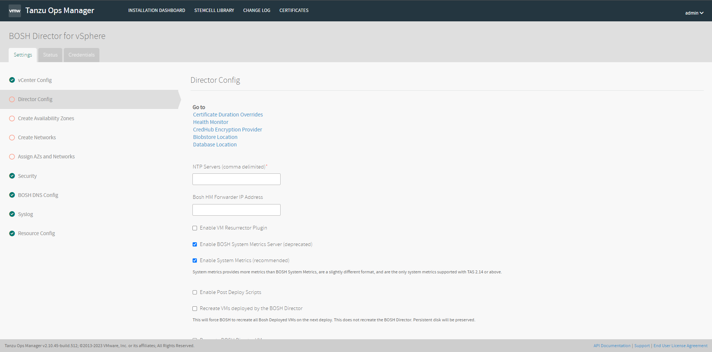
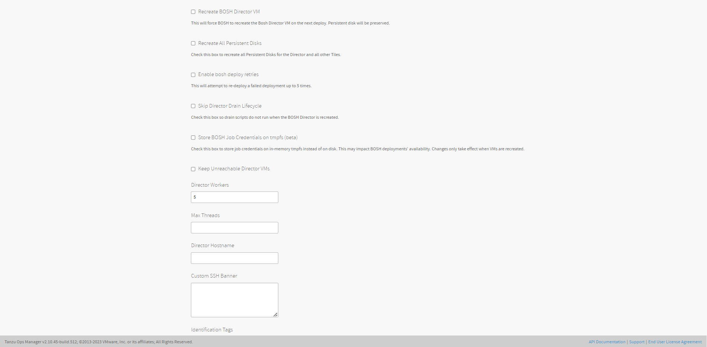
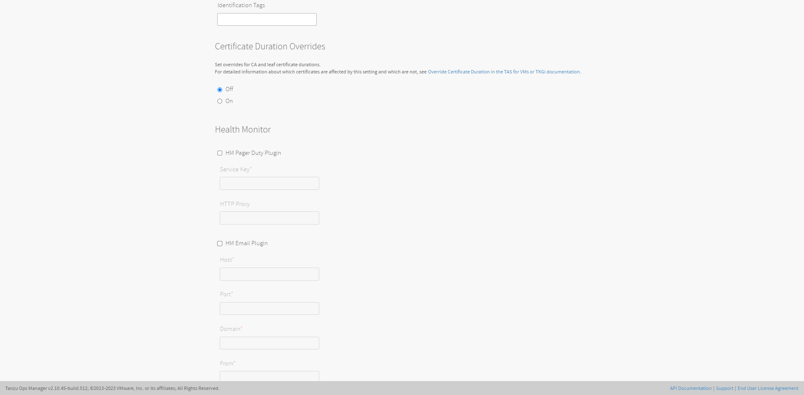
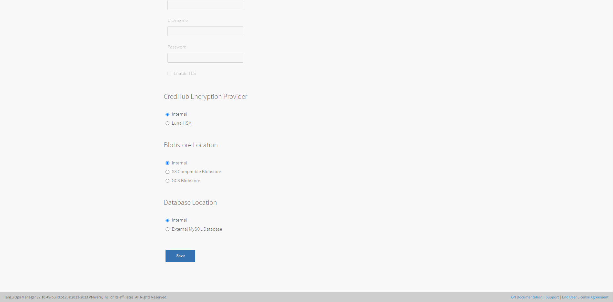
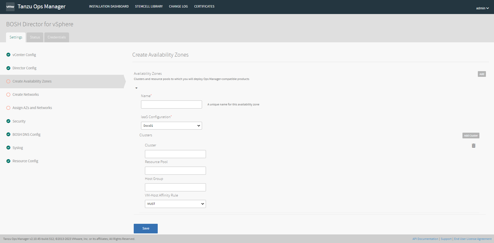

# 설치 방법

## BOSH Director 설치

#### BOSH Director for vSphere

- **vCenter Config**

1. **Name :** 운영자가 구분할 수 있는 이름을 작성합니다. 여러 데이터 센터를 구성하는 경우 Ops Manager에서 데이터 센터 구성을 식별하는 데 사용됩니다.

2. **vCenter Host :** ESXi/vSphere를 관리하는 vCenter의 호스트 이름입니다.

3. **vCenter Username :** 가상 머신(VM) 및 폴더에 대한 생성 및 삭제 권한이 있는 vCenter 사용자 이름입니다.

4. **vCenter Password :** 위에서 지정한 vCenter 사용자의 비밀번호입니다.

5. **Datacenter Name :** vCenter에 표시되는 데이터 센터의 이름입니다.

6. **Virtual Disk Type :** 모든 VM에 대해 프로비저닝할 가상 디스크 유형입니다. 가상 디스크 유형 선택에 대한 지침은 [vSphere 가상 디스크 유형을](https://docs.pivotal.io/application-service/operating/disk-format.html) 참조하십시오.
   
   - Thin Provisioned : 빠른 프로비저닝과 디스크 공간을 데이터 저장소의 VMs에 오버커밋할 수 있습니다. 초기 쓰기 작업 중 오버헤드로 인해 성능이 느릴 수 있습니다. 클러스터링 기능을 지원하지 않습니다.
   
   - Thick Provisioned : 물리적 장치의 디스크 공간을 그대로 할당합니다. Thin에 비해 프로비저닝 속도가 느립니다. 
   
   ※ *Note:  데이터 저장소는 이름에 공백 문자를 지원하지 않습니다. 데이터 저장소 이름에 공백 문자를 포함하면 오류가 발생합니다.*

7. **Ephemeral Datastore Names (comma delimited) :** Ops Manager에서 배포한 임시 VM 디스크를 저장하는 데이터 저장소의 이름입니다.

8. **Ephemeral Datastore Cluster Names (comma delimited) :** Ops Manager에서 배포한 임시 VM 디스크를 저장하는 데이터 저장소 클러스터의 이름입니다. 데이터 저장소 이름과 데이터 저장소 클러스터가 지정된 경우 둘 다 디스크 배치에 대해 고려됩니다. 데이터스토어 클러스터에 대해 Storage DRS를 비활성화하면 BOSH CPI가 클러스터를 무시합니다. 자세한 내용은 [Storage DRS 활성화 및 비활성화를](https://docs.vmware.com/en/VMware-vSphere/7.0/com.vmware.vsphere.resmgmt.doc/GUID-827DBD6D-08B7-4411-9214-9E126671457F.html) 참조하십시오 .

9. **Persistent Datastore Names (comma delimited)**: Ops Manager에서 배포한 영구 VM 디스크를 저장하는 데이터 저장소의 이름입니다.

10. **Persistent Datastore Cluster Names (comma delimited) :** Ops Manager에서 배포한 영구 VM 디스크를 저장하는 데이터 저장소 클러스터의 이름입니다. 데이터 저장소 이름과 데이터 저장소 클러스터가 지정된 경우 둘 다 디스크 배치에 대해 고려됩니다. 데이터스토어 클러스터에 대해 Storage DRS를 비활성화하면 BOSH CPI가 클러스터를 무시합니다. 자세한 내용은 [Storage DRS 활성화 및 비활성화를](https://docs.vmware.com/en/VMware-vSphere/7.0/com.vmware.vsphere.resmgmt.doc/GUID-827DBD6D-08B7-4411-9214-9E126671457F.html) 참조하십시오 .
    
    ※ *Note:  데이터 저장소 클러스터는 공유 리소스 및 공유 관리 인터페이스가 있는 데이터 저장소 모음입니다.*

11. 네트워킹을 구성하려면 아래에 설명된 **vCenter 구성** 필드를 완료해야합니다.
    
    - **Standard vCenter Networking:** Ops Manager를 업그레이드할 때 기본 옵션입니다. **이 옵션을 선택하면 아래의 NSX-T 네트워킹** 필드를 구성할 필요가 없습니다.
    
    - **NSX-T Networking:** VM용 TAS 제품에 대해 NSX-T 네트워크 가상화를 허용하려면 이 옵션을 선택합니다. 이 가상화를 통해 BOSH Director 타일의 **리소스 구성** 창 에서 구성 요소 로드 밸런싱 및 보안을 구성할 수 있습니다.

12. 다음 폴더 이름을 구성합니다.
    
    - **VM Floder :** Ops Manager가 VM을 배치하는 vSphere 데이터 센터 폴더입니다.
    
    - **Template Folder :** Ops Manager가 템플릿을 배치하는 vSphere 데이터 센터 폴더입니다.
    
    - **Disk path Folder :** Ops Manager가 연결된 디스크 이미지를 생성하는 vSphere 데이터 저장소 폴더입니다.

※ *Note:  추가 vCenter를 구성하려면 상단에 있는 Add vCenter Config를 클릭합니다.*

##### 모든 설정 입력 후 Save를 클릭합니다.

- **Director Config**

1. **NTP Servers :** NTP 서버 구성은 VM 재생성 후에만 업데이트 됩니다. 이 필드의 값을 수정하는 경우 BOSH Director에서 배포한 VM 다시 만들기 확인란을 선택하여 VM을 다시만들고 NTP 서버 구성을 업데이트 해야합니다. 설치된 서비스 타일이 있는 경우 모든 서비스 인스턴스 재생성 errand가 동작하는지 확인해야합니다.

2. **Bosh HM Forwarder IP Address :** 빈 공간으로 설정합니다. TAS v2.0부터 기본적으로 Loggregator Firehose를 통해 구성 요소 메트릭을 받을 수 있습니다. 

3. **Enable VM Resurrector Plugin :** BOSH Resurrector 기능을 활성화하고 런타임 가용성을 높이려면 확인란을 선택합니다.

4. **Enable BOSH System Metrics Server (deprecated) :** BOSH Director VM에서 자세한 지표를 수집하려면 **추가 시스템 지표 활성화** 확인란을 활성화합니다.

5. **Enable System Metrics (recommended) :** 시스템 메트릭은 BOSH 시스템 메트릭 보다 더 많은 메트릭을 제공하며, 다른 형식의 데이터를 제공합니다. TAS 2.14이상에서 지원하는 기능입니다. 

6. **Enable Post Deploy Scripts :** 배포 후 배포 후 스크립트를 실행하려면 배포 후 스크립트 **활성화를** 선택합니다 . 이 스크립트를 사용하면 작업이 배포에 대해 추가 명령을 실행할 수 있습니다.

7. **Recreate VMs deployed by the BOSH Director :**  BOSH가 다음 배포 시 BOSH에 의해 배포된 VM을 다시 생성하도록 합니다. 이 프로세스는 BOSH Director VM을 재생성하거나 영구 디스크 데이터를 삭제하지 않습니다. 이 확인란은 성공적인 재배포 후 자동으로 선택 취소됩니다.

8. **Recreate BOSH Director VM :** 다음 배포 시 BOSH Director VM을 강제로 다시 만듭니다. 이 프로세스는 영구 디스크 데이터를 삭제하지 않습니다. 이 확인란은 성공적인 재배포 후 자동으로 선택 취소됩니다.

9. **Recreate All Persistent Disks :** BOSH가 BOSH Director 및 모든 타일에 대한 영구 디스크를 마이그레이션하고 다시 생성하도록 합니다. 이 프로세스는 영구 디스크 데이터를 삭제하지 않습니다. 이 확인란은 성공적인 재배포 후 자동으로 선택 취소됩니다.

10. **Enable bosh deploy retries :** Ops Manager가 실패한 BOSH 작업을 최대 5회까지 재시도하도록 지시합니다.

11. **Skip Director Drain Lifecycle :** BOSH Director가 다시 생성될 때 드레인 스크립트가 실행되지 않도록 하려면 선택하십시오.(작업이 다시 시작되거나 중지될 때 실행하는 스크립트)

12. **Store BOSH Job Credentials on tmpfs (beta) :** BOSH 작업에 대한 자격 증명을 디스크가 아닌 임시 파일 저장소(tmpfs) 메모리에 저장하려면 선택합니다. 이 설정을 적용하려면 모든 BOSH Director VM을 다시 생성해야 합니다.

13. **Keep Unreachable Director VMs :** 문제 해결 및 분석을 위해 실패한 배포 후 BOSH Director VMs를 보존하려면 선택합니다.

14. (선택)**Director Workers :** BOSH Director 작업을 실행 할 수 있는 작업자 수를 설정합니다. 이 필드의 기본값은 5입니다.

15. (선택)**Max Threads :** BOSH Director가 동시에 실행할 수 있는 최대 스레드 수를 설정합니다. VMware에서는 IaaS에서 속도 제한 또는 오류가 발생하지 않는 한 기본값을 사용하려면 필드를 비워둘 것을 권장합니다.

16. (선택)**Director Hostname :** BOSH Director에 대한 사용자 지정 URL을 추가하려면 호스트 이름을 입력합니다. 이 필드를 사용하여  BOSH Director 앞에 로드 밸런서를 구성할 수도 있습니다.

17. (선택)**Custom SSH Banner :** SSH를 사용하여 BOSH Director에 로그인할 때 사용자가 볼 수 있는 사용자 지정 배너를 설정하려면 **Custom SSH Banner** 필드에 텍스트를 입력합니다.

18. (선택)**Identification Tags :** 쉼표로 구분된 사용자 지정 식별 태그를 입력합니다. 예를 들어, `iaas:foundation1, hello:world`. IaaS에서 VM 또는 디스크를 볼 때 태그를 사용하여 기반을 식별할 수 있습니다.

19. **Certificate Duration Overrides :**  Ops Manager 및 CredHub 내에서 생성된 인증서가 인증서에 대해 지정된 기본 기간을 사용하는지 또는 사용자가 지정하는 사용자 정의 기간 값을 사용하는지 여부를 선택할 수 있습니다.
    
    - Off : 모든 제품에서 생성된 인증서에 기본 기간을 사용하려면 이 옵션을 선택합니다.
    
    - On : 모든 제품에서 생성된 인증서의 기간을 사용자 정의 값을 설정하려면 이 옵션을 선택합니다. 
      
      - CA Certificate Duration (days) : CA 인증서가 유효한 일 수를 입력합니다.
      
      - Leaf Certificate Duration (days) : 리프 인증서가 유효한 일 수를 입력합니다. 이 값은 CA 인증서 기간보다 작거나 같아야 합니다.
      
      ※ *Note:  인증서 기간 재정의를 설정한 후 모든 인증서에 설정을 적용하려면 추가 단계를 수행해야합니다. 자세한 내용은  [인증서 기간 재정의 단원을](https://docs.vmware.com/en/VMware-Tanzu-Operations-Manager/3.0/vmware-tanzu-ops-manager/security-pcf-infrastructure-configure-certificate-duration-overrides.html) 참조하십시오.*

20. **HM Pager Duty Plugin :** PagerDuty와 Health Monitor 통합을 활성화하려면 선택하십시오.
    
    - Service Key : PagerDuty의 API 서비스 키를 입력합니다.
    
    - HTTP Proxy : PagerDuty와 함께 사용할 HTTP 프록시를 입력합니다.

21. **HM Email Plugin :** Health Monitor를 이메일과 통합하려면 선택하십시오.
    
    - Host : 이메일 호스트 이름을 입력합니다.
    
    - Port : 이메일 포트 번호를 입력합니다.
    
    - Domain : 도메인을 입력하세요.
    
    - From : 보내는 사람의 주소를 입력합니다.
    
    - Recipients : 원하는 받는 사람의 주소를 쉼표로 구분하여 입력합니다.
    
    - Username : 이메일 서버의 사용자 이름을 입력합니다.
    
    - Password : 이메일 서버의 비밀번호를 입력합니다.
    
    - Enable TLS : 전자 메일 호스트에 대한 전송 계층 보안을 활성화하려면 이 확인란을 선택합니다.

22. **CredHub Encryption Provider :** BOSH CredHub이 암호화 키를 BOSH Director 및 CredHub VM 내부에 저장할지 또는 외부 HSM(하드웨어 보안 모듈)에 저장할지를 선택할 수 있습니다. HSM 설정 후 Ops Manager를 배포한 후에는 암호화 키를 내부에 저장하도록 BOSH CredHub를 변경할 수 없습니다.

23. **Blobstore Location :** Blobstore를 내부 서버 또는 외부 엔드포인트로 구성합니다. 내부 서버는 확장할 수 없고 보안 수준이 낮기 때문에 외부 Blobstore를 구성하는 것이 좋습니다.
    
    ※ *BOSH Director를 배포한 후에는 Advanced 모드의 Ops Manager 사용자만 blobstore 위치를 변경할 수 있습니다.*
    
    - **Internal:** 내부 blobstore를 사용하려면 이 옵션을 선택합니다. Ops Manager는 Blob 저장소에 대한 새 VM을 만듭니다. 추가 구성이 필요하지 않습니다.
    
    - **S3 Compatible Blobstore:** 외부 S3 호환되는 endpoint를 사용하려면 이 옵션을 선택합니다. S3 버킷을 생성했으면 다음 필드를 구성합니다.
      
      1. S3 Endpoint:
         
         1. **퍼블릭 S3 엔드포인트를 사용하는 경우 :**
            
            1. 해당 지역의 endpoint를 찾습니다. 
            
            2. 해당 지역의 endpoint를 사용하여 URL을 구성합니다. 예를 들어 지역을 사용하는 경우 `us-west-2`생성하는 URL은 입니다 `https://s3.us-west-2.amazonaws.com`. 이 URL을 **S3 Endpoint** 필드에 입력합니다.
         
         2. **비공개 S3 호환 endpoint를 사용하는 경우 :**
            
            1. 비공개 끝점의 URL을 입력합니다.
            2. **Director Config** 페이지 의 **Trusted Certificates** 필드 에 S3 엔드포인트 서명에 사용한 사용자 지정 퍼블릭 CA 인증서를 추가합니다 .
      
      2. **Bucket Name:** S3 버킷의 이름을 입력합니다.
      
      3. **Access Key 및 Secret Key :** S3 버킷을 생성할 때 생성한 키를 입력합니다.
      
      4. **URL Style:** path 스타일 또는 도메인 스타일을 선택하여 S3 호환 blobstore의 URL 스타일을 지정합니다. 기본적으로 blobstore는 도메인 스타일 URL을 사용합니다.
      
      5. **Enable signed URLs :** BOSH 에이전트와 blobstore 간의 통신을 위해 미리 서명된 단기 URL을 생성하도록 BOSH VM을 구성하려면 이 확인란을 선택합니다. 이 기능을 활성화하면 BOSH 에이전트는 자격 증명을 사용하여 blobstore와 통신하지 않으며 VM 디스크는 blobstore 자격 증명을 저장하지 않습니다.
         
         ※ *Note:  해당 기능은 Xenial stemcell 621 이상을 사용하는 BOSH VM에서만 사용할 수 있습니다.*
      
      6. **S3 Signature Version :** V2 Signature 또는 V4 Signature를 선택합니다.    
      
      7. **S3 Backup Strategy :** BOSH Director의 S3 blobstore 백업 여부와 방법을 구성하려면 다음 옵션 중 하나를 선택하십시오.
         
         - No backups
         
         - **Use a versioned bucket :** 이 옵션은 blobstore 버킷 버전 관리를 사용하여 백업을 저장합니다. 버전 관리를 지원하는 S3 blobstore가 필요합니다.
         
         - **Copy into an additional bucket :** 이 옵션은 Blobstore 백업을 별도의 버킷에 저장하며, 이는 버전 관리를 지원하지 않는 Blobstore에 유용합니다. 이 옵션을 사용하려면 백업 버킷 지역 및 백업 버킷 이름 필드를 구성해야 합니다.
    
    - **GCS Blobstore :** 외부 Google Cloud Storage(GCS) endpoint를 사용하려면 이 옵션을 선택합니다.

24. **Database Location :** 기본적으로 Ops Manager는 내부 데이터베이스를 배포하고 관리합니다. 외부 MySQL 데이터베이스를 사용하기로 선택한 경우 BOSH Director에만 적용됩니다. UAA 및 CredHub는 이러한 설정을 사용하지 않고 BOSH Director와 함께 배치된 Postgres 데이터베이스를 계속 사용합니다. 
    
    ※ *Note:  **BOSH Director를 배포한 후에는** **외부 MySQL 데이터베이스** 에서 **내부** 데이터베이스 로 또는 **내부 데이터베이스에서** **외부 MySQL** 데이터베이스로 **데이터베이스 위치를** 변경할 수 없습니다 .*

##### 모든 설정 입력 후 Save를 클릭합니다.

- **Create Availability Zones**

