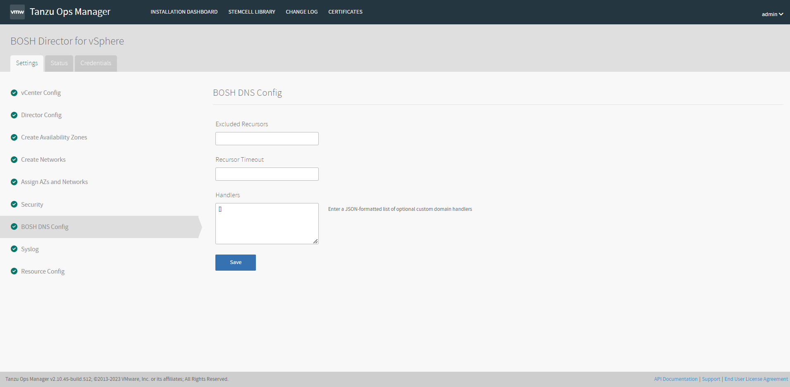

- ### Syslog

1. (선택)**Do you want to configure Syslog for Bosh Director? :** Yes를 선택 시 BOSH Director 시스템 로그를 원격 서버로 보냅니다.

2. **Address :** 원격 서버의 IP 주소 또는 DNS 이름을 입력합니다.

3. **Port :** 원격 서버에 접근할 수 있는 포트 번호를 입력하십시오.

4. **Transport Protocol :** **TCP** 또는 **UDP를** 선택합니다. 이 선택은 원격 서버에 로그를 보내는데 사용되는 전송 프로토콜을 결정합니다.

5. (선택)**Enable TLS :** TLS를 사용 하여 원격 서버에 암호화된 로그를 보내려면 Enable TLS를 선택합니다. 확인란을 선택한 후:
   
   1. **Permitted Peer :** 원격 피어의 이름(예:*.example.com) 또는 SHA1를 입력합니다.
   
   2. **SSL Certificate :** 원격 서버의 SSL 인증서를 입력합니다.

6. (선택)**Queue Size :** 정수를 입력합니다. 이 값은 버퍼에 보관된 로그 메시지 수를 지정합니다. 기본값은 100,000입니다.

7. (선택)**Forward Debug Logs :** 디버그 로그를 원격 서버로 전달 합니다. 이 옵션은 기본적으로 선택 취소되어 있습니다. 선택하면 대량의 로그 데이터가 생성될 수 있습니다.

8. (선택)**Custom rsyslog Configuration :** rsyslog에 대한 구성 세부 정보를 입력합니다. 이 필드에는 rainerscript 구문이 필요합니다.

##### 모든 설정 입력 후 Save를 클릭합니다.

- ### Resource Config

1. INSTANCES, VM TYPE, PERSISTENT DISK TYPE 필드 아래의 드롭다운 메뉴에서 Automatic을 선택하거나 환경에 맞는 리소스를 할당할 수 있습니다.

2. PERSISTENT DISK TYPE 필드에 None 값이 표시되면 작업에 영구 디스크 공간이 필요하지 않은 것입니다.
   
   ※ *Note:  BOSH Director 작업의 경우 메모리가 8GB 이상인 VM 유형을 선택하십시오.*
   
   ※ *Note:  필드를 Automatic으로 설정한 후 권장 리소스 할당이 향후 버전에서 변경되면 Ops Manager는 자동으로 업데이트된 권장 할당을 사용합니다.*

3. (선택)**vCenter 구성 :** NSX-T 네트워킹을 구성했고 BOSH Director 작업에 대한 보안 및 로드 밸런싱을 구성하려는 경우:
   
   1. BOSH Director 작업 이름 옆에 있는 메뉴 확장 아이콘을 클릭합니다 . NSX-T 구성 필드가 나타납니다.
   
   2. 이 필드에 NSX-T 구성 값을 입력합니다.

##### 모든 설정 입력 후 Save를 클릭합니다.

